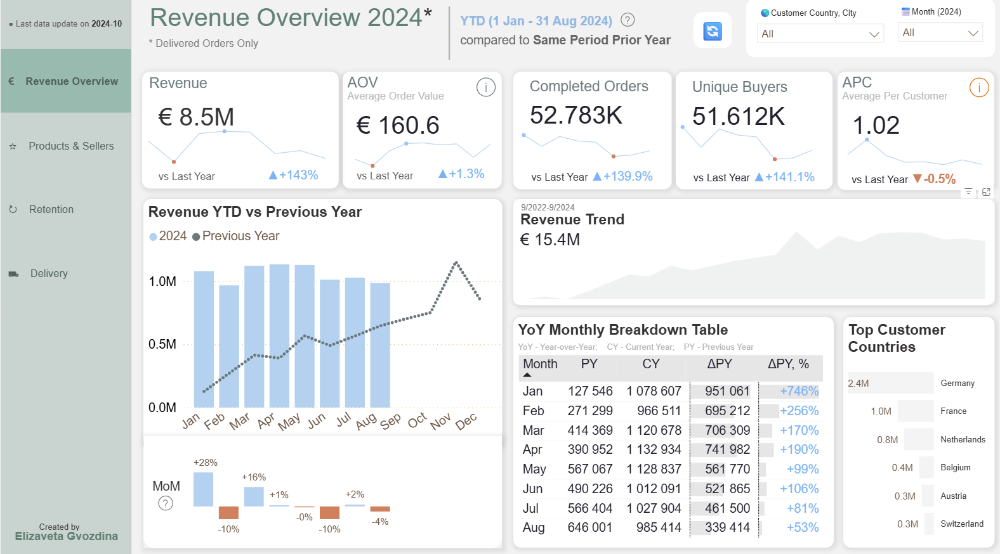
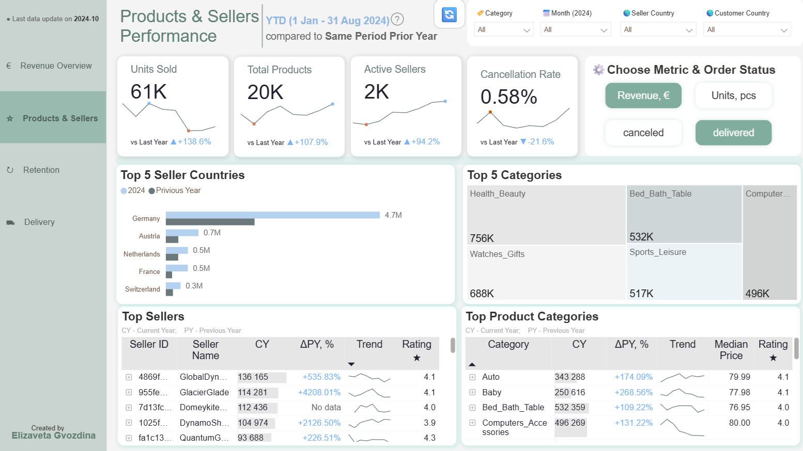
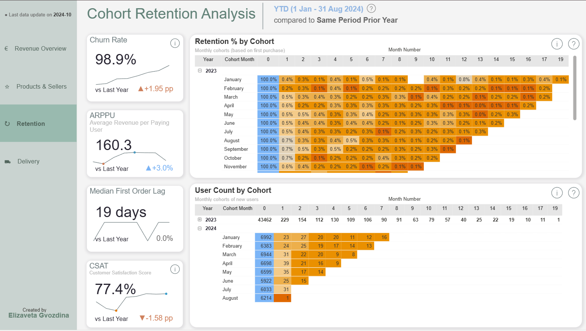
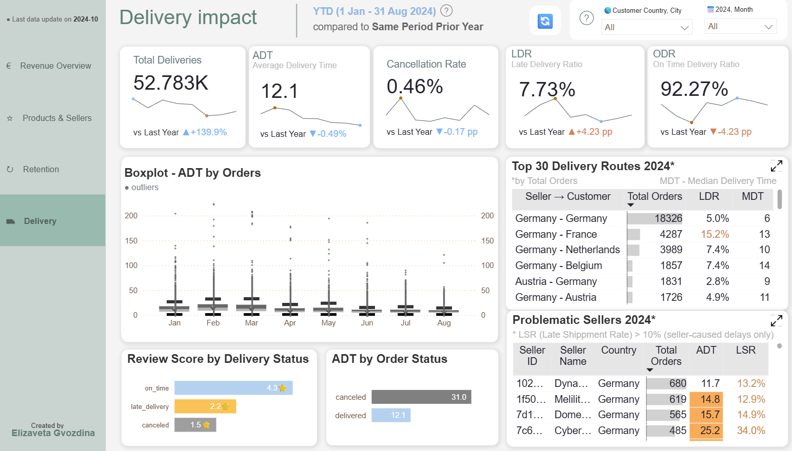
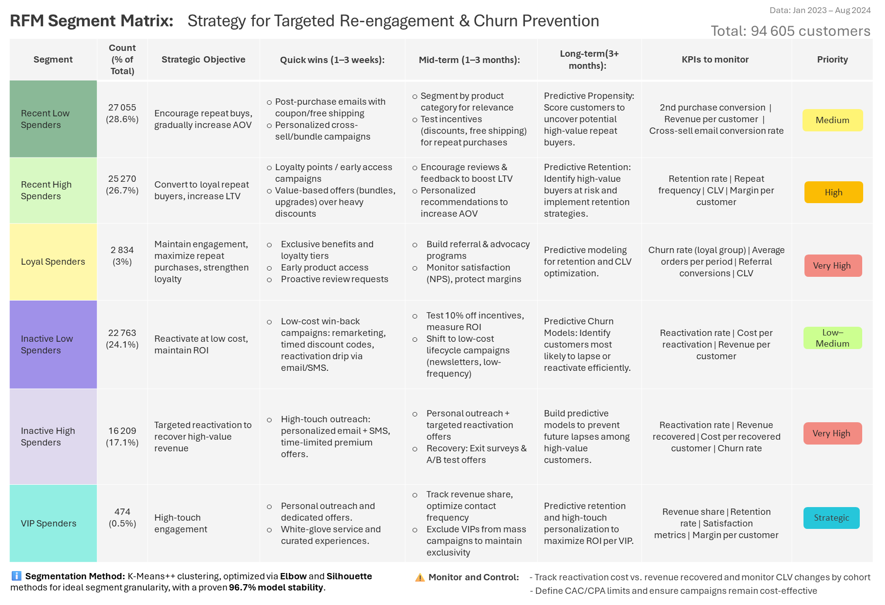

# E-commerce Analytics Case Study
🛠️**Project Stack**:&nbsp;&nbsp;`SQL (PostgreSQL, pgAdmin 4, joins, window functions)` | `Python (Pandas, NumPy, scikit-learn, seaborn, matplotlib)` | `Jupyter Notebook` | `Power BI (DAX)` | `RFM Analysis` | `Cohort Analysis` 

## Business Context
[Fecom Inc.](#dataset) is a growing Berlin-based e-commerce marketplace connecting thousands of sellers with a broad customer base. Over two years, the platform processed tens of thousands of orders, generating substantial transactional data dispersed across multiple tables. This led to inconsistent KPIs, making it difficult to monitor performance, understand customer behavior, or assess delivery efficiency.

## The Objective: Turning Disparate Data into Strategic Clarity🎯

The goal of this project was to build a comprehensive analytical solution that transforms raw transactional data into a single, reliable source of insight.
The project focus was twofold:

1. `Business Performance Analysis`: Developing a unified dashboard that allows monitoring key KPIs and YTD performance against the previous year, providing clear visibility into revenue trends, top categories, top sellers, delivery impact, and cohort analysis to monitor customer behaviour and retention trends over time.

2. `Advanced Customer Segmentation`: Moving beyond basic metrics by applying RFM-based segmentation with K-Means clustering. This approach enabled the identification of high-value loyal customers, early detection of at-risk segments, and the discovery of data-driven retention opportunities.

# Table of Contents
- [Interactive Dashboard & Insights](#dashboard-details-and-insights) 
- [RFM Customer Segmentation & Retention Strategy](#customer-segmentation-with-rfm-and-k-means)  
- [Data Engineering: Cleaning, ELT Pipeline, Data Model](#data-engineering) 
- [Dataset](#dataset) 
- [Limitations](#limitations) 
- [Contact](#contact)  

<h1 id="dashboard-details-and-insights">⭐ Interactive Dashboard & Insights</h1>

Click to open the interactive Power BI dashboard → 🚀[View the Dashboard](https://app.powerbi.com/view?r=eyJrIjoiMWEzOWMwZmUtZmZlYS00YzcwLWFhMjAtOGVhMGJmOGJkZGRhIiwidCI6IjFlYWQ2ZmY5LTIxOTItNGE2OC05ODQ2LTNiYTUwNGQ4MGViYiJ9&pageName=e2f321812e80b51cafb2) &nbsp;&nbsp;<a href="https://app.powerbi.com/view?r=eyJrIjoiMWEzOWMwZmUtZmZlYS00YzcwLWFhMjAtOGVhMGJmOGJkZGRhIiwidCI6IjFlYWQ2ZmY5LTIxOTItNGE2OC05ODQ2LTNiYTUwNGQ4MGViYiJ9&pageName=e2f321812e80b51cafb2"> 

Detailed page-by-page descriptions, insights, and screenshots are provided below.
 

##  1️⃣ Revenue Overview 
*Click to interact⤵️* 

This dashboard highlights a record-breaking 143% Year-to-Date (YTD)  revenue surge, demonstrating successful market penetration in Europe driven by high-volume customer acquisition.

**Purpose of the Page** 

The primary goal of this dashboard is to track YTD revenue performance and compare it against the same period of the previous year. It enables stakeholders to evaluate the effectiveness of growth strategies, monitor market expansion, and identify seasonal purchasing trends to optimize financial planning. 

**What this page shows** 

- YTD revenue and key KPIs with YoY comparison  
- Monthly YTD vs prior-year revenue trend  
- YoY Monthly Breakdown: A detailed data table providing exact figures for current vs. previous year revenue and the resulting growth variance.
- Top revenue-generating countries

**Top 3 Insights**💡

- `Acquisition-Driven Growth:` &nbsp; Revenue has grown by 143% YTD, mainly due to a significant increase in order volume (+139.9%). Stable AOV and a low APC indicate that growth relies largely on new customer acquisition rather than repeat purchases or pricing expansion. Most customers place only one order, making growth more dependent on marketing spend and potentially limiting long-term scalability.

- `Dominant Market Share in Germany:` &nbsp; Customers in Germany generated the highest revenue (€2.4M), significantly outperforming other regions, indicating a highly successful localized market strategy.

- `Month-over-Month Dips:` &nbsp; Revenue dips in February and June may indicate seasonal trends or potential operational constraints.

 

##  2️⃣ Products & Sellers Performance
*Click to interact⤵️* 

This dashboard illustrates the marketplace's supply-side health, highlighting hyper-growth in seller activity, product portfolio expansion, and revenue concentration across geographies and categories.

**Purpose of the Page** 

The goal of this page is to monitor YTD performance for sellers and products, benchmark it against the prior year, and support data-driven ecosystem management. Stakeholders can identify high-potential sellers, optimize category strategies, and ensure service quality remains strong during rapid scaling.

**What this page shows** 

- Key volume KPIs (Units Sold, Products, Active Sellers) with YoY comparison
- Service quality metric (Cancellation Rate) and trend
- Interactive Filter: The "Choose Metric & Order Status" panel allows users to dynamically change the primary calculation (Revenue or Units) and the included order statuses (delivered, canceled) to gain different performance views.
- Top 5 revenue-generating countries
- Category distribution via treemap
- Detailed leaderboards for Top Sellers and Top Product Categories, including growth rates (PY %) and trends

**Top 3 Insights**💡

- `Long-Lifespan Product Categories Driving Value`: &nbsp; The platform features durable, high-value items (e.g., Housewares, Furniture & Decor) that contribute significantly to overall revenue. Their longer purchase cycles mean repurchases are infrequent, which can limit short-term retention, highlighting the need for targeted engagement to maintain customer loyalty.

- `Hyper-Growth Across the Ecosystem:` &nbsp; Units (+141.9%), Products (+111.2%), and Sellers (+102.1%) have all more than doubled YTD, indicating rapid expansion and adoption of the platform.

- `Germany Leads Revenue:` &nbsp; Sellers based in Germany contribute ~€4.7M, outperforming all other seller countries combined, though all top regions show positive growth YTD

 

## 3️⃣ Cohort Retention Analysis
*Click to interact⤵️* 

This dashboard provides a diagnostic view of customer behavior over time, highlighting retention patterns, churn risk, and revenue per user to inform strategies that improve Customer Lifetime Value (LTV).

**Purpose of the Page**

The main goal is to track how different user cohorts behave post-acquisition, identify retention weaknesses, and evaluate the effectiveness of engagement strategies. Stakeholders can pinpoint where the business loses customers and take targeted action to enhance loyalty and revenue sustainability.

**What this page shows** 

- KPIs: Churn Rate, ARPPU, First Order Lag, CSAT with YoY comparison
- Retention % by Cohort: Heatmap showing the share of users returning in subsequent months
- User Count by Cohort: Absolute volume of new users in each cohort, providing context for retention percentages

**Top 3 Insights**💡

- `Extremely High Churn:`&nbsp; In 2024 YTD (31/08), 98.9% of customers churned, up +1.95 pp YoY, indicating a highly transactional model with minimal repeat purchase behavior.

- `Immediate Drop-off:`&nbsp; Month 1 retention falls below 1% across almost all cohorts, revealing weak post-purchase engagement or insufficient incentives for second purchases.

- `Stable Acquisition:`&nbsp; Monthly cohorts bring in ~6,000–7,000 new users consistently, confirming effective top-of-funnel marketing. The retention bottleneck is post-purchase.

 

## 4️⃣ Delivery Impact 
*Click to interact⤵️* 

This dashboard evaluates the efficiency and reliability of the logistics network, highlighting delivery performance, and seller accountability to protect customer satisfaction and retention.

**Purpose of the Page** 

The goal is to monitor YTD delivery performance, identify underperforming routes or sellers, and support data-driven operational improvements. Stakeholders can pinpoint causes of delays and cancellations, optimize route planning, and maintain high customer satisfaction.

**What this page shows** 

* KPIs: Total Deliveries, ADT (Average Delivery Time), LDR (Late Delivery Ratio), ODR (On Time Delivery Ratio)
* Delivery Stability: Boxplot of delivery times month-over-month to detect outliers
* Route Performance: Top delivery routes ranked by LDR
* Customer Impact: Correlation of delivery status with average customer review scores
* Vendor Accountability: Sellers contributing disproportionately to late deliveries

**Top 3 Insights**💡

* `Strong Order Volume Growth:` &nbsp; Order volume surged +139.9%, with LDR at 7.73% (+4.23 pp YoY).
* `Cross-Border Bottlenecks:` &nbsp; Germany-France route underperforms with 15.2% LDR, almost double other major routes (Germany-Netherlands 7.4%, Germany-Germany 5.0%).
* `Customer Satisfaction Impact:` &nbsp; Late deliveries correlate with lower review scores (from 4.3 stars to 2.2 stars), suggesting a potential reputational effect.

 

<h1 id="customer-segmentation-with-rfm-and-k-means">⭐ Customer Segmentation with RFM and K-Means & Retention Strategy</h1>

*View the full customer analysis* ➡️ [RFM_segmentation_with_KMeans.ipynb](./rfm_clustering_analysis/RFM_segmentation_with_KMeans.ipynb)

**What’s inside the notebook:**
- SQL data extraction from PostgreSQL  
- EDA (~100k transactions)   
- RFM calculation and preprocessing  
- K-Means clustering with Elbow & Silhouette methods  
- Cluster stability validation (ARI)  
- Customer segment interpretation and business actions 

Customers are segmented using RFM (Recency, Frequency, Monetary) metrics and K-Means clustering to identify patterns in purchasing behavior and support targeted marketing and retention strategies. The matrix below presents **the results of our RFM analysis**, summarizing each customer segment along with the recommended business actions derived from the data to improve retention and maximize revenue.

  

**RFM Analysis Results:**

- `Six distinct customer segments identified:` &nbsp; Recent Low Spenders, Recent High Spenders, Inactive Low Spenders, Inactive High Spenders, Loyal Spenders, and VIP Spenders, enabling differentiated retention and monetization strategies.

- `Clear business actions defined:` &nbsp; Each segment mapped to prioritized, time-phased actions (quick wins, mid-term, long-term) with measurable KPIs to support churn reduction and CLV growth. 

- `High churn risk quantified:` &nbsp; ~97% of customers made only one purchase, confirming low retention as a core business challenge and validating the need for lifecycle-based marketing strategies

- `Outlier handling improved model quality:` &nbsp; Top 0.5% spenders isolated as VIPs to prevent distortion of K-Means centroids and improve interpretability.

- `Robust clustering achieved:` &nbsp; 5-cluster solution validated via Elbow Method and Silhouette Score. Cluster stability confirmed with a mean Adjusted Rand Index (ARI) of 0.97 across multiple runs.

- `Production-ready output delivered:` &nbsp; Clean customer-level segmentation exported to CSV, with clear business-ready fields and structure suitable for direct integration into Power BI dashboards.

**Quick RFM Recommendations Summary: 💡**

The RFM analysis highlights the importance of **building loyalty** by implementing mechanisms that encourage repeat purchases and **strengthen attachment to the platform**:

- `Customer conversion & nurturing:` Turn one-time buyers into repeat customers, nurture high-value and loyal clients, reactivate inactive users, and protect VIPs.

- `Retention initiatives:` Use discounts on second purchases, coupons, targeted emails, and remarketing campaigns.

- `Loyalty programs:` Foster long-term engagement and promote new products or services to the most loyal customers for early feedback.

- `Long-term strategies:` Apply predictive retention measures and data-driven models to anticipate churn and maximize lifetime value.

These actions strengthen engagement, **reduce marketing costs**, and **increase campaign ROI**.

 

<h1 id="data-engineering">🛠️ Data Engineering</h1>

This section outlines the engineering work behind the data, including its preparation, transformation, and modelling, ensuring it is reliable, well-structured, and ready for analysis and reporting.

## Data Cleaning 
The raw data from the source datasets is cleaned using the following notebook: ➡️[Data Preprocessing Notebook](./elt_scripts/data_preprocessing.ipynb) 

**What’s inside:**
- Dataset structure review and data quality validation (missing values, duplicates, key integrity)
- Data cleaning and standardisation (formatting, encoding)
- Distribution analysis of key metrics to inform dashboard design
- Preparation and export of cleaned data for PostgreSQL

## ELT 
The data is ingested, normalized, and loaded into PostgreSQL using a **Python** ➡️[ELT Pipeline](./elt_scripts/ELT_pipeline.py), which executes the ➡️[SQL scripts](./sql_scripts/):

- `create_db.sql:` defines the database schema, tables, constraints, and **indexes** on PKs, FKs, and temporal columns (**DDL**)

- `load_data.sql:` inserts raw CSV data into tables (**DML**)

- `normalize_geolocations.sql:` refactors geolocation data and applies surrogate keys for consistency

- `bi_analytics_layer.sql:` creates pre-aggregated analytical views for reporting and dashboards

- `check_orphans.sql:` verifies data integrity and identifies orphan records

The Python pipeline automates schema setup, data loading, and normalization, preparing the database for analysis and Power BI dashboards.

## Data Model 
The project uses different data models across layers to balance storage efficiency and analytical usability:

1. **PostgreSQL (Data Storage Layer)**  
   Source data is normalized up to the Third Normal Form (3NF) in a snowflake-style schema. This reduces redundancy, ensures data integrity, and supports efficient storage.

2. **Power BI (Analytics / Semantic Layer)**  
     A star schema with multiple fact tables at different grains is implemented to simplify relationships, filtering, and measure calculations. Power BI uses the VertiPaq engine, which stores data in a highly compressed, columnar format. This makes star schemas with clear fact-dimension relationships extremely fast for aggregations and slicers.

The Entity-Relationship Diagram (ERD) of the PostgreSQL database can be viewed below:  
➡️ [PostgreSQL ERD](./ERD/ERD_normalized.png)  

The star-schema data model implemented in Power BI is illustrated here:  
➡️ [Power BI Star Schema](./ERD/powerbi_model.png)

This setup optimizes data storage in PostgreSQL while keeping analytical queries and reporting in Power BI clear, performant, and easy to maintain.

 

<h1 id="dataset">🛠️ Dataset</h1>

- Fecom Inc. is a e-commerce marketplace company based in Berlin, Germany. Between 2022 and 2024, it recorded 99 441 orders from 102 727 unique customers and tracked all commercial transactions of 3 095 sellers.
- Source: [Kaggle - Fecom Inc. e-commerce orders](https://www.kaggle.com/datasets/cemeraan/fecom-inc-e-com-marketplace-orders-data-crm/data)
- License: CC BY-NC-SA 4.0
- Collection Methodology: Random Sampling + Market and Company Research Report Results about e-Com[Specific confidential company]
- The project integrates [8 relational tables](./data/raw) covering the full e-commerce workflow:

| Source table | Description |
|-------------|-------------|
| Fecom Inc Geolocations | Geographic reference data (postal code, city, country, coordinates) used by customers and sellers |
| Fecom Inc Customer List | Customer identifiers, subscription details, demographics |
| Fecom Inc Sellers List | Seller information linked to geolocation |
| Fecom Inc Products | Product attributes and physical characteristics |
| Fecom Inc Orders | Order-level data, status, and lifecycle timestamps |
| Fecom Inc Order Items | Product-level details for each order (price, freight, seller, product) |
| Fecom Inc Order Payments | Payment details and transaction values |
| Fecom_Inc_Order_Reviews_No_Emojis | Customer ratings and review information |

<h1 id="limitations">🛠️ Limitations</h1>

- Temporal coverage is limited to 2022–2024, preventing reliable estimation of long-term trends and seasonality.
- Returns and refunds data is not available, preventing net revenue and return rate analysis.
- Customer acquisition and funnel data is not available, preventing analysis of conversion efficiency and customer acquisition cost (CAC) beyond completed and cancelled orders.
- Planned sales targets or budget benchmarks are not available, performance evaluation relies on year-over-year comparisons.

<h1 id="contact"> 📞Contact</h1>

**Project author:**  Elizaveta Gvozdina 
**LinkedIn:** [https://www.linkedin.com/in/gvozdina/](https://www.linkedin.com/in/gvozdina/) 
**Email:** lisagvozdina@gmail.com 