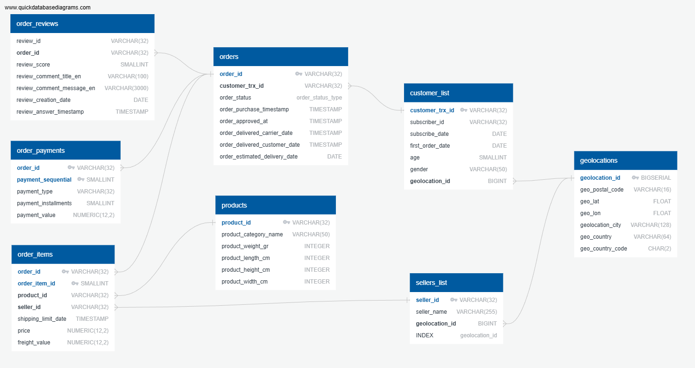
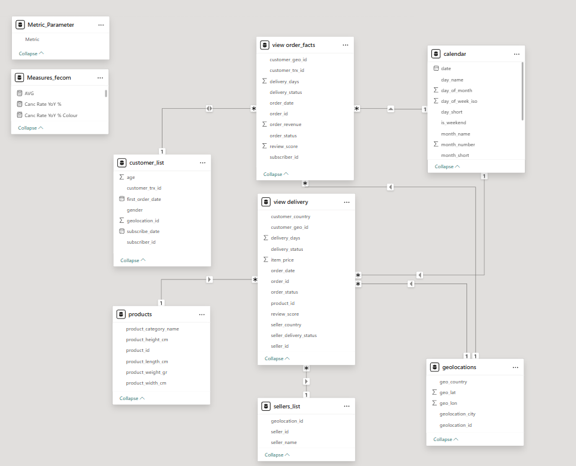

# E-commerce Analytics Case Study

## Business Context
Fecom Inc. is a growing e-commerce marketplace connecting sellers with a broad customer base. Daily orders, shipments, and customer interactions generate substantial data, but it is stored across multiple tables without a unified view.

As a result:  
- Revenue, product, and seller performance are hard to monitor  
- Customer behavior and retention patterns are difficult to analyze  
- KPIs are inconsistent, making benchmarking challenging
- Delivery and fulfillment bottlenecks are not easily detected

This project consolidates these datasets into a single analytical dashboard, providing a year-to-date view benchmarked against the previous year, enabling actionable insights for revenue, product assortment, seller management, customer engagement, and operational efficiency.

## Table of Contents

[Business Objectives](#business-objectives) 
[Methodology](#methodology) 
[Data Model](#data-model) 
[Insights](#insights) 
[Dataset](#dataset) 
[Next Steps](#next-steps) 
[How to Use](#how-to-use) 
[Contact](#contact)  

## Business Objectives
- Provide a clear, consolidated view of year-to-date performance, highlighting trends in revenue, customer behavior, and operational metrics  
- Monitor KPIs across revenue, retention, product assortment, seller efficiency, and delivery operations  
- Identify top-performing and underperforming products and sellers to guide assortment and partner management  
- Detect bottlenecks in delivery and fulfillment to improve efficiency and customer satisfaction  
- Deliver actionable insights that inform strategic initiatives with measurable impact

## Data Model
The project uses different data models across layers to balance storage efficiency and analytical usability:

1. **PostgreSQL (Data Storage Layer)**  
   Source data is normalized up to the Third Normal Form (3NF) in a snowflake-style schema. This reduces redundancy, ensures data integrity, and supports efficient storage.

2. **Power BI (Analytics / Semantic Layer)**  
     A star schema with multiple fact tables at different grains is implemented to simplify relationships, filtering, and measure calculations. Power BI uses the VertiPaq engine, which stores data in a highly compressed, columnar format. This makes star schemas with clear fact-dimension relationships extremely fast for aggregations and slicers.

The Entity-Relationship Diagram (ERD) of the PostgreSQL database can be viewed below:  
  

The star-schema data model implemented in Power BI is illustrated here:  

This setup optimizes data storage in PostgreSQL while keeping analytical queries and reporting in Power BI clear, performant, and easy to maintain.

## Dataset
- Fecom Inc. is a fictional e-commerce marketplace company based in Berlin, Germany. Between 2022 and 2024, it recorded 99 441 orders from 102 727 unique customers and tracked all commercial transactions of 3 095 sellers.
- Source: [Kaggle — Fecom Inc. e-commerce orders](https://www.kaggle.com/datasets/cemeraan/fecom-inc-e-com-marketplace-orders-data-crm/data)
- License: CC BY-NC-SA 4.0

## Contact
**Project author:**  Elizaveta Gvozdina 
**Email:** lisagvozdina@gmail.com 
**Phone**: +44 7874 755842 

